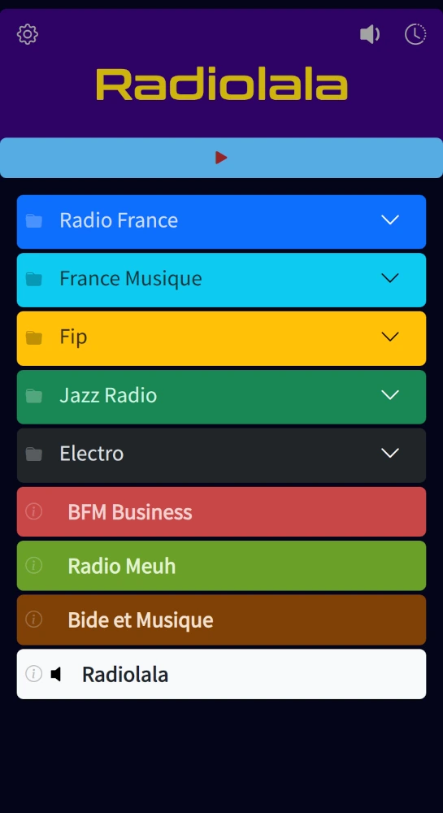
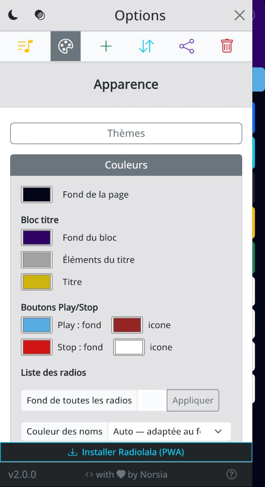
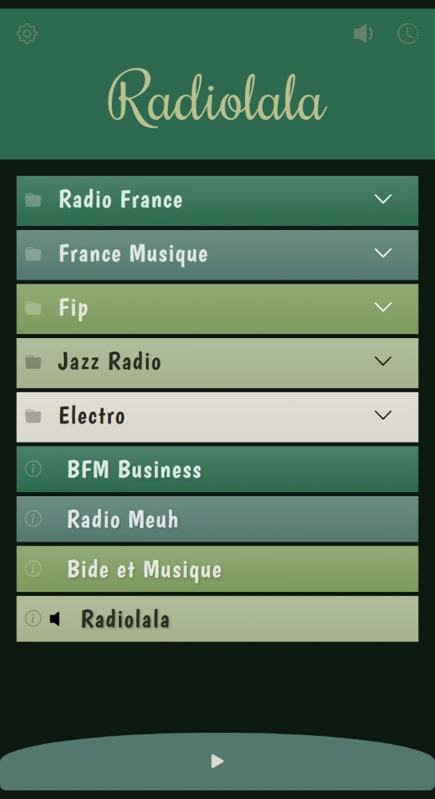

<div align="center">


# Radiolala

**Lecteur de webradios minimaliste, personnalisable et respectueux de votre vie privée.**

[](LICENSE)


[**▶ Essayer la démo**](https://norsia-fr.github.io/radiolala)

</div>

---

<p align="center">
  
  
  
</p>

## Présentation

Radiolala est une application web (PWA) pour écouter, organiser et personnaliser ses radios en ligne. Elle est conçue pour une expérience simple et épurée, tout en offrant une personnalisation poussée de l'interface.

Installable sur ordinateur, tablette ou smartphone, elle fonctionne ensuite comme une application classique — y compris hors connexion pour son interface.

## 🔒 Vie privée

**Radiolala ne collecte rien et n'envoie aucune donnée personnelle.**

- Aucun compte, aucune inscription.
- Aucun serveur, aucun backend : tout fonctionne directement dans votre navigateur.
- Vos playlists, thèmes et réglages sont stockés **uniquement en local** (localStorage), sur votre appareil.
- Aucun traceur, aucune publicité, aucune télémétrie.

Les seules requêtes réseau sortantes sont :
- les **flux audio** des radios que vous écoutez (directement vers leurs serveurs) ;
- l'**API Radio-Browser.info**, uniquement lorsque vous lancez une recherche de radios.

## Fonctionnalités

- 🎵 **Lecture de webradios** avec fondu sonore à l'arrêt
- 📂 **Playlists et dossiers** pour organiser vos radios
- ✋ **Glisser-déposer** pour réordonner (y compris à l'intérieur d'un dossier)
- 🔎 **Recherche** de radios via [Radio-Browser.info](https://www.radio-browser.info/)
- 🎨 **Thèmes** prédéfinis et personnels (couleurs, polices, mise en page)
- 🌈 **Palettes de couleurs** pour vos radios (application en masse ou couleur automatique à l'ajout)
- ⏲️ **Sleep timer** avec fondu progressif et durées préréglées
- 🕘 **Historique** des radios écoutées
- 🔊 **Volume mémorisé par radio** (pour égaliser des radios trop fortes ou trop faibles)
- 🔁 **Import / export** de playlists, thèmes et palettes dans un simple fichier `.json`
- 🌗 **Mode clair / sombre**
- 📱 **Installable** (PWA) sur tous vos appareils

## Stack technique

- [Vue 3](https://vuejs.org/) (Composition API, `<script setup>`)
- [Pinia](https://pinia.vuejs.org/) — gestion d'état
- [VueUse](https://vueuse.org/) — composables utilitaires
- [Bootstrap 5](https://getbootstrap.com/) + [Bootstrap Icons](https://icons.getbootstrap.com/)
- [marked](https://marked.js.org/) — rendu Markdown
- [Vue CLI](https://cli.vuejs.org/) — build

## Installation locale (développement)

Prérequis : [Node.js](https://nodejs.org/) (LTS recommandé).

```bash
git clone https://github.com/norsia-fr/radiolala.git
cd radiolala
npm install
npm run serve
```

L'application est alors disponible sur `http://localhost:8080`.

## Build de production

```bash
npm run build
```

Le résultat est généré dans `dist/`. Les chemins étant relatifs, ce dossier est **portable** : il peut être déposé à n'importe quel emplacement d'un serveur web (racine ou sous-dossier) sans configuration supplémentaire.

## Crédits

- Recherche de radios propulsée par l'API communautaire [Radio-Browser.info](https://www.radio-browser.info/).
- Développé avec ❤️ par **Norsia**.

## Licence

Distribué sous licence **GNU General Public License v3.0**. Voir le fichier [LICENSE](LICENSE) pour les détails.
